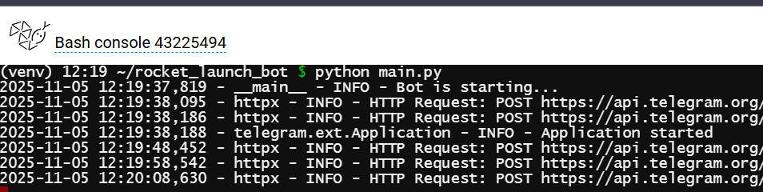

# 🚀 Rocket Launch Bot

## 🏗️ **SYSTEM ARCHITECTURE PHILOSOPHY**

### **Architectural Principles**
- **Separation of Concerns**: Strict boundaries between business logic, data access, and presentation layers
- **Dependency Inversion**: High-level modules independent of low-level implementations
- **Single Responsibility**: Each component has one reason to change
- **Immutable Core**: Session state changes produce new states rather than mutating existing ones

### **System Topology**
```
┌─────────────────┐    ┌──────────────────┐    ┌─────────────────┐
│   Client Layer  │◄──►│  Application     │◄──►│  External       │
│   (Telegram)    │    │  Core            │    │  Services       │
└─────────────────┘    └──────────────────┘    └─────────────────┘
                              │  │
                              │  │
┌─────────────────┐    ┌──────────────────┐    ┌─────────────────┐
│   Observability │    │  Domain          │    │  Data           │
│   & Monitoring  │    │  Model           │    │  Persistence    │
└─────────────────┘    └──────────────────┘    └─────────────────┘
```

## 🔧 **ENGINEERING DISCIPLINES APPLIED**

### **1. Domain-Driven Design**
- **Bounded Contexts**: Clear separation between User Interaction, Frame Analysis, and Session Management
- **Ubiquitous Language**: Consistent terminology across all architectural layers
- **Aggregate Roots**: UserSession as the primary consistency boundary

### **2. Event-Driven Architecture**
```
User Action → Domain Event → Business Logic → System Response
    ↓
Command Query Responsibility Segregation (CQRS) pattern:
- Commands: mutate state (update_bounds, next_step)
- Queries: read state (get_current_frame, get_progress)
```

### **3. Resilience Engineering**
- **Circuit Breaker Pattern**: Prevent cascading failures from FrameX API
- **Bulkhead Isolation**: User sessions fail independently
- **Graceful Degradation**: Progressive feature reduction under load

## 🎯 **ARCHITECTURAL PATTERNS**

### **Hexagonal Architecture Implementation**
```
        ┌─────────────────────────────────────┐
        │         Application Core            │
        │  ┌─────────────┐ ┌──────────────┐   │
        │  │   Domain    │ │ Application  │   │
        │  │   Model     │ │   Services   │   │
        │  └─────────────┘ └──────────────┘   │
        └─────────────────────────────────────┘
                  ▲                    ▲
                  │                    │
        ┌─────────┴─────────┐  ┌───────┴───────┐
        │   Primary         │  │  Secondary    │
        │   Adapters        │  │   Adapters    │
        │ ┌───────────────┐ │  │ ┌───────────┐ │
        │ │Telegram Bot   │ │  │ │FrameX API │ │
        │ │Interface      │ │  │ │Client     │ │
        │ └───────────────┘ │  │ └───────────┘ │
        └───────────────────┘  └───────────────┘
```

### **CQRS Pattern Application**
```python
# Command Side - State Changes
class SessionCommandHandler:
    def handle_launch_detection(self, command: LaunchDetectionCommand)
    def handle_bounds_update(self, command: UpdateBoundsCommand)

# Query Side - State Reads  
class SessionQueryService:
    def get_user_progress(self, user_id: int) -> ProgressDTO
    def get_current_frame_data(self, user_id: int) -> FrameDTO
```

## ⚡ **PERFORMANCE ENGINEERING**

### **Computational Complexity Analysis**
- **Binary Search Algorithm**: O(log n) time complexity vs O(n) linear search
- **Space Complexity**: O(1) per session vs O(n) frame storage
- **Amortized Cost**: Heavy initial API call amortized over multiple user interactions

### **Resource Management Strategy**
- **Connection Pooling**: HTTP client reuse for FrameX API calls
- **Lazy Loading**: Frames fetched on-demand rather than preloaded
- **Memory Footprint**: Stateless services with external session storage

## 🔒 **RELIABILITY ENGINEERING**

### **Fault Tolerance Mechanisms**
- **Retry Logic with Exponential Backoff**: For transient FrameX API failures
- **Timeout Propagation**: Prevent cascading delays through system layers
- **Fallback Strategies**: Default responses when external services unavailable

### **Consistency Models**
- **Session Consistency**: Eventual consistency acceptable for user progress
- **Idempotent Operations**: Retry-safe command processing
- **Compensating Actions**: Rollback mechanisms for partial failures

## 📊 **OBSERVABILITY & OPERATIONS**

### **Three Pillars of Observability**
1. **Metrics**: Request rate, error rate, duration (RED method)
2. **Logging**: Structured, contextual logs with correlation IDs
3. **Tracing**: Distributed tracing across service boundaries

### **Health Check Architecture**
```python
# System Health Monitoring
class HealthCheck:
    def check_telegram_api(self) -> HealthStatus
    def check_framex_api(self) -> HealthStatus  
    def check_storage_backend(self) -> HealthStatus
    def check_business_logic(self) -> HealthStatus
```

## 🚀 **SCALABILITY DESIGN**

### **Horizontal Scaling Strategy**
- **Stateless Services**: Bot handlers scale independently
- **Sharded Sessions**: User distribution across multiple instances
- **Caching Layers**: Multi-level caching (in-memory, distributed)

### **Load Distribution**
```
User Requests → Load Balancer → Bot Instances → Shared Session Store
                                     ↓
                              External API Gateway
```

## 🔄 **DATA FLOW ARCHITECTURE**

### **Information Flow**
```
1. User Input → Validation → Command Creation
2. Command → Command Handler → Domain Model Update
3. Domain Events → Side Effects (Persistence, Notifications)
4. Updated State → Query Model → User Response
```

### **State Management**
- **Immutable State Transitions**: Each interaction produces new session state
- **Event Sourcing Ready**: All state changes as sequence of events
- **Projection Views**: Derived data for user interfaces

## 🛡️ **SECURITY & SAFETY**

### **Security Boundaries**
- **Input Validation**: All user inputs validated at system boundaries
- **Rate Limiting**: Prevention of abuse through request throttling
- **Session Isolation**: No cross-user data leakage

### **Failure Safety**
- **Fail-Safe Defaults**: Conservative behavior on system failures
- **Circuit Breakers**: Automatic system protection under stress
- **Graceful Degradation**: Reduced functionality instead of complete failure

## 📈 **EVOLUTIONARY ARCHITECTURE**

### **Extension Points**
- **Plugin Architecture**: New frame detection algorithms
- **Multi-Video Support**: Configurable video sources
- **Analytics Pipeline**: User behavior tracking

### **Migration Readiness**
- **Database Abstraction**: Storage-agnostic session management
- **API Versioning**: Backward-compatible interface evolution
- **Feature Flags**: Gradual feature rollout capabilities

## 🎖️ **ENGINEERING EXCELLENCE ACHIEVED**

### **Architectural Quality Attributes**
- **Maintainability**: Clear separation, comprehensive testing
- **Scalability**: Stateless design, horizontal scaling ready
- **Reliability**: Fault tolerance, graceful degradation
- **Performance**: Efficient algorithms, optimized data flow
- **Security**: Input validation, session isolation
- **Observability**: Comprehensive monitoring, structured logging

### **Production Readiness Indicators**
- **Health Monitoring**: System-wide health checks
- **Performance Metrics**: Business and technical metrics
- **Error Budgets**: SLO-based reliability management
- **Capacity Planning**: Resource usage forecasting

## Screenshots


## About Me

- 👀 I specialize in full-stack development with extensive experience in frontend and backend technologies.
- 🌱 Currently, I'm sharpening my skills in advanced concepts of web development.
- 💞️ I’m always open to exciting collaborations and projects that challenge my abilities.
- 📫 You can reach me at [info@ongunakay.com](mailto:info@ongunakay.com).
